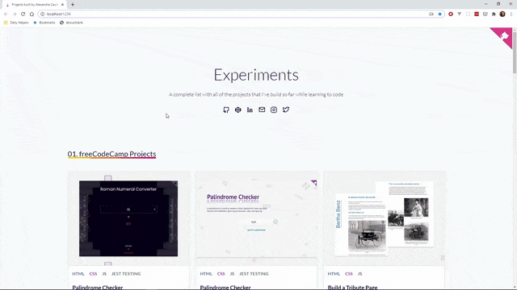

# My Projects

A complete list with all of the projects that I've built so far while learning to code.

[See the page here](https://my-projects.netlify.app/)

## 01. Projects built using a Frontend Framework / Library

|  #  | Project Name        | Live example                           | Code on GitHub                                                 |
| :-: | ------------------- | -------------------------------------- | -------------------------------------------------------------- |
| 1.  | Image Cards Project | [Demo](https://img-cards.netlify.app/) | [Check the code](https://github.com/alexandracaulea/img-cards) |

 

## 02. Working with APIs

I've wanted to learn how to fetch data from an API and display the data so I've built the _"Fetching and Displaying Jobs"_ project. For the API I've used the [GitHub Jobs API](https://jobs.github.com/api) and to fetch data I've used [axios](https://github.com/axios/axios).

The _"Sign up Landing Page"_ and _"Accept Terms and Conditions Component"_ projects were built to practice working with the Intersection Observer API.

|  #  | Project Name                          | Live example                                            | Code on GitHub                                                                                                                   |
| :-: | ------------------------------------- | ------------------------------------------------------- | -------------------------------------------------------------------------------------------------------------------------------- |
| 1.  | Working with Google Maps API          | [Demo](https://pensive-allen-40f285.netlify.app/)       | [Check the code](https://github.com/alexandracaulea/coloring-of-sectors)                                                         |
| 2.  | Fetching and Displaying Jobs          | [Demo](https://codepen.io/alexandracaulea/full/VwLBGOj) | [Check the code](https://github.com/alexandracaulea/working-with-apis/tree/master/Fetching%20and%20Displaying%20Jobs)            |
| 3.  | Sign up Landing Page                  | [Demo](https://codepen.io/alexandracaulea/full/mdygyxV) | [Check the code](https://github.com/alexandracaulea/working-with-apis/tree/master/Sign%20up%20Landing%20Page)                    |
| 4.  | Accept Terms and Conditions Component | [Demo](https://codepen.io/alexandracaulea/full/VwYOPKM) | [Check the code](https://github.com/alexandracaulea/working-with-apis/tree/master/Accept%20Terms%20and%20Conditions%20Component) |

 

## 03. freeCodeCamp Projects

Projects that I've completed while going though the freeCodeCamp Curriculum.

1. Responsive Web Design Projects

|  #  | Project Name                         | Live example                                            | Code on GitHub                                                                                                                                                     |
| :-: | ------------------------------------ | ------------------------------------------------------- | ------------------------------------------------------------------------------------------------------------------------------------------------------------------ |
| 1.  | Build a Tribute Page                 | [Demo](https://codepen.io/alexandracaulea/full/MWwgbEv) | [Check the code](https://github.com/alexandracaulea/freecodecamp-projects/tree/master/Responsive-Web-Design-Projects/Build%20a%20Tribute%20Page)                   |
| 2.  | Build a Survey Form                  | [Demo](https://codepen.io/alexandracaulea/full/YzXdNbY) | [Check the code](https://github.com/alexandracaulea/freecodecamp-projects/tree/master/Responsive-Web-Design-Projects/Build%20a%20Survey%20Form)                    |
| 3.  | Build a Product Landing Page         | [Demo](https://codepen.io/alexandracaulea/full/QWbObOQ) | [Check the code](https://github.com/alexandracaulea/freecodecamp-projects/tree/master/Responsive-Web-Design-Projects/Build%20a%20Product%20Landing%20Page)         |
| 4.  | Build a Technical Documentation Page | [Demo](https://codepen.io/alexandracaulea/full/zYGKdzZ) | [Check the code](https://github.com/alexandracaulea/freecodecamp-projects/tree/master/Responsive-Web-Design-Projects/Build%20a%20Technical%20Documentation%20Page) |
| 5.  | Build a Personal Portfolio Webpage   | [Demo](https://codepen.io/alexandracaulea/full/ZEbLxRG) | [Check the code](https://github.com/alexandracaulea/freecodecamp-projects/tree/master/Responsive-Web-Design-Projects/Build%20a%20Personal%20Portfolio%20Webpage)   |

2. JavaScript Algorithms and Data Structures Projects

|  #  | Project Name                    | Live example                                                  | Code on GitHub                                                                                                                                                                  |
| :-: | ------------------------------- | ------------------------------------------------------------- | ------------------------------------------------------------------------------------------------------------------------------------------------------------------------------- |
| 1.  | Celsius to Fahrenheit Converter | [Demo](https://codepen.io/alexandracaulea/full/rNVKLor)       | [Check the code](https://github.com/alexandracaulea/freecodecamp-projects/tree/master/JavaScript-Algorithms-and-Data-Structures-Projects/Celsius%20to%20Fahrenheit%20Convertor) |
| 2.  | Palindrome Checker              | [Demo](https://alexandracaulea.github.io/palindrome-checker/) | [Check the code](https://github.com/alexandracaulea/palindrome-checker)                                                                                                         |
| 3.  | Roman Numeral Converter         | [Demo](https://alexandracaulea.github.io/roman-converter/)    | [Check the code](https://github.com/alexandracaulea/roman-converter)                                                                                                            |

 

## 04. UI Elements

Each project was built to help me get better at working with HTML, CSS and JavaScript.

|  #  | Project Name      | Live example                                            | Code on GitHub                                                                                     |
| :-: | ----------------- | ------------------------------------------------------- | -------------------------------------------------------------------------------------------------- |
| 1.  | UI Tabs Component | [Demo](https://codepen.io/alexandracaulea/full/zYxmoop) | [Check the code](https://github.com/alexandracaulea/ui-elements/tree/master/UI%20Tabs)             |
| 2.  | Product Card      | [Demo](https://codepen.io/alexandracaulea/full/QWwJgdM) | [Check the code](https://github.com/alexandracaulea/ui-elements/tree/master/Product%20Card)        |
| 3.  | User Profile Card | [Demo](https://codepen.io/alexandracaulea/full/wvBLyqJ) | [Check the code](https://github.com/alexandracaulea/ui-elements/tree/master/User%20Profile%20Card) |
| 4.  | Pricing Tables    | [Demo](https://codepen.io/alexandracaulea/full/xxGVPYd) | [Check the code](https://github.com/alexandracaulea/ui-elements/tree/master/Pricing%20Tables)      |
| 5.  | Four Card Layout  | [Demo](https://codepen.io/alexandracaulea/full/dyoOJKd) | [Check the code](https://github.com/alexandracaulea/ui-elements/tree/master/Four%20Card%20Layout)  |

 

## 05. CSS Grid

My initial projects that I've built while learning to code. I've wanted mainly to start using CSS Grid. I must warn you, there are not looking amazing.

|  #  | Project Name | Live example                                            | Code on GitHub                                                             |
| :-: | ------------ | ------------------------------------------------------- | -------------------------------------------------------------------------- |
| 1.  | Layout 1     | [Demo](https://codepen.io/alexandracaulea/full/VwYMwRp) | [Check the code](https://github.com/alexandracaulea/layouts/tree/master/1) |
| 2.  | Layout 2     | [Demo](https://codepen.io/alexandracaulea/full/QWwmdPG) | [Check the code](https://github.com/alexandracaulea/layouts/tree/master/2) |
| 3.  | Layout 3     | [Demo](https://codepen.io/alexandracaulea/full/ZEYoGmz) | [Check the code](https://github.com/alexandracaulea/layouts/tree/master/3) |
| 4.  | Layout 4     | [Demo](https://codepen.io/alexandracaulea/full/ZEYoaPe) | [Check the code](https://github.com/alexandracaulea/layouts/tree/master/4) |
| 5.  | Layout 5     | [Demo](https://codepen.io/alexandracaulea/full/abzGrjz) | [Check the code](https://github.com/alexandracaulea/layouts/tree/master/5) |
| 6.  | Layout 6     | [Demo](https://codepen.io/alexandracaulea/full/wvBxGYr) | [Check the code](https://github.com/alexandracaulea/layouts/tree/master/6) |
| 7.  | Layout 7     | [Demo](https://codepen.io/alexandracaulea/full/JjoBwZL) | [Check the code](https://github.com/alexandracaulea/layouts/tree/master/7) |
| 8.  | Layout 8     | [Demo](https://codepen.io/alexandracaulea/full/JjoavbN) | [Check the code](https://github.com/alexandracaulea/layouts/tree/master/8) |
| 9.  | Layout 9     | [Demo](https://codepen.io/alexandracaulea/full/Exaddav) | [Check the code](https://github.com/alexandracaulea/layouts/tree/master/9) |

 
 

[See the entire page](https://my-projects.netlify.app/)

[You can check the page here](https://my-projects.netlify.app/)
